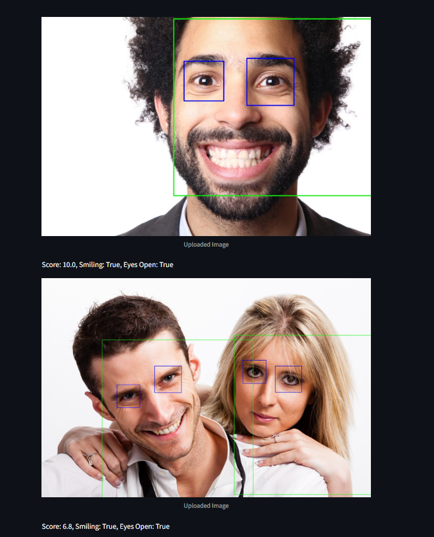
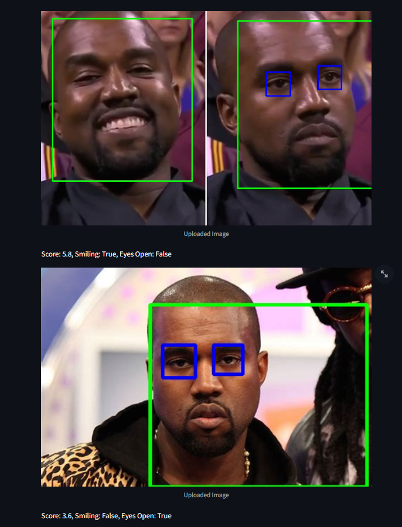

## Image Printability Rating 

 
 

## FEATURES
1. UI for image upload and inference
2. Live video inference
3. Smiling ranking network using transfer learning on EffnetB0 (224x224) (5M params) w/ multiclass classifier (4 classes). <br> Data based on [FERplus](https://github.com/Microsoft/FERPlus) dataset (35k images for 8 different emotions, 10 people make choices for each image).  <br> The wide range of emotions should make the network better at detecting not_smiling instances. <br>
    Data was a little unbalanced, so underperforms at mild and moderate smiling predictions. <br>
    80.4% Test accuracy (mainly due to moderate and mild smiling classifications). 

4. Face detection using OpenCV DNN and a small 140k param ResNet10 (300x300).

5. Eye cascades for blink detection. Low overhead and decent performance (except with glasses)


## Rating Formula

Calculate open_eye_ratio = 0.5 * (eye_count / face_count)

Calculate avg_smiling_score  = sum(face_smiling_predictions) / len(face_smiling_predictions)

-> smiles are weighted {none : 0.2, mild: 0.5, moderate: 0.7, huge : 1.0}

final_score = 0.8 * avg_smiling_score + 0.2 * open_eye_ratio 


##  USAGE
1. Install requirements.txt
2. In terminal:  ```streamlit run src/app.py```

##  TRAINING
1. Download fer2013.csv file: https://drive.google.com/file/d/1eICwh1wUO4DBJqMpOxqoStoejEg_MgZ0/view?usp=sharing to root
2. Run ``` python src/generate_training_data.py```
3. Run all cells in  ```smiling_score.ipynb```


## NOTES / POSSIBLE IMPROVEMENTS 
1.  Effb0 uses 3 channels for the input and the training data is grayscale. <br> A fresh network with less parameters can
be trained. 

2. Initially trained smiling net on numerical classifications based on smiling_score (happiness + surprise) from FERplus dataset. <br> Got a training loss of 0.78 after 20 epochs with a test accuracy of 52% likely due to overfitting.

3. Due to data imbalance issues in the smiling net dataset, prediction scores are more likely to be very static as moderate and mild smiling predictions are few and far inbetween.

4. Trained a binary convolutional classifer net for eye open/close detection but it underperformed.
Dataset was 5k images and balanced. Tried with dropout layers but it still didn't perform sufficiently. Can be improved.
